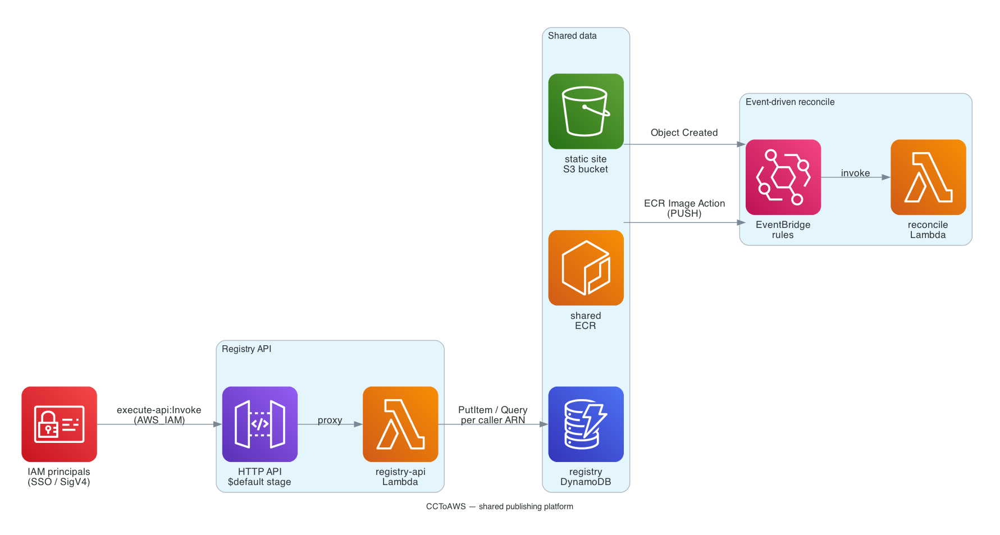

# CCToAWS

Self-contained AWS publishing platform for **static sites** (S3) and **container images** (ECR), with a **registry HTTP API** (API Gateway + Lambda + DynamoDB) and **EventBridge** hooks for reconciliation. **Terraform** provisions **shared resources only**; application deployments use the **AWS CLI** (or SDK) guided by the Claude Code skill.

## Diagram


## What Terraform creates

- Versioned, SSE-S3 encrypted **S3 bucket** with **Amazon EventBridge notifications** enabled.
- Shared **ECR repository** with a simple lifecycle policy.
- **DynamoDB** table for per-caller app metadata (`USER#<principalArn>` / `APP#<appId>`).
- **HTTP API** (`POST /v1/register`, `GET /v1/apps`, `GET /v1/apps/{appId}`) with **AWS IAM (SigV4)** authorization.
- **Lambdas** for the API and for EventBridge-driven **reconcile** logging (extend as needed).
- **EventBridge rules** for ECR image pushes and S3 object creation in the static bucket.
- **IAM managed policies** for **ABAC-style** S3 prefix access, shared ECR access (requires a **session tag** on the principal), and **`execute-api:Invoke`** on the HTTP API.

Attach the three managed policies (or copies of them) to your **IAM Identity Center permission sets** as appropriate. Configure Entra / Identity Center to pass a **session tag** whose key matches `abac_user_tag_key` (for example `user_id`).

## What Terraform does *not* create (v1)

- **CloudFront, WAF, ALB** for a shared internal hostname — add these in a follow-up change without altering the core registry model.
- **Per-app** ECS services, App Runner services, or other runtime resources — create and update those with the **CLI** and record URLs via **`/v1/register`**.

## URL model (planned, part 2)

Static sites use **one shared HTTPS hostname** with **paths that mirror the S3 prefix**: `https://<shared_host>/<user_tag>/<app_id>/` (same segments as `s3://$BUCKET/<user_tag>/<app_id>/`). See `docs/superpowers/specs/2026-03-23-platform-design.md` for the full note on containers and Register.

## Deploy shared infrastructure

```bash
cd terraform
cp terraform.tfvars.example terraform.tfvars
# Edit terraform.tfvars — set unique bucket name, region, tags.

terraform init
terraform plan
terraform apply
```

Copy outputs (`http_api_endpoint`, `static_bucket_id`, `ecr_repository_url`, IAM policy ARNs) into your team’s documentation or into `~/.config/cct-aws/config.json` for the skill.

## CLI flows (after SSO login)

```bash
export AWS_PROFILE=your-sso-profile
aws sts get-caller-identity
```

- **Static:** `scripts/publish-static.sh` — sync to `s3://${bucket}/${user_id}/...`, then `POST /v1/register` with `deployment_type=static`.
- **Container:** build and push to ECR, create/update **App Runner** (or ECS) out of band, then `POST /v1/register` with `deployment_type=container` and `image_uri` / `runtime_url`.

Use **`aws` CLI v2** with **`aws sigv4-sign-request`** or **`awscurl`** patterns, or small wrappers, to call the HTTP API with the same SSO credentials.

## Claude Code skill

See `skills/publish-aws/SKILL.md` — copy into your Claude Code skills directory or reference this repository.

## Security notes

- **Shared ECR** with only principal-tag conditions is **weaker isolation** than per-user repositories. For stricter isolation, create additional repositories via CLI with naming `u-${user_id}-*` and narrow IAM further.
- **Register API** keys rows by **SigV4 caller ARN**; keep permission boundaries tight so users cannot assume each other’s roles.

## License

Use and modify for your organization.
