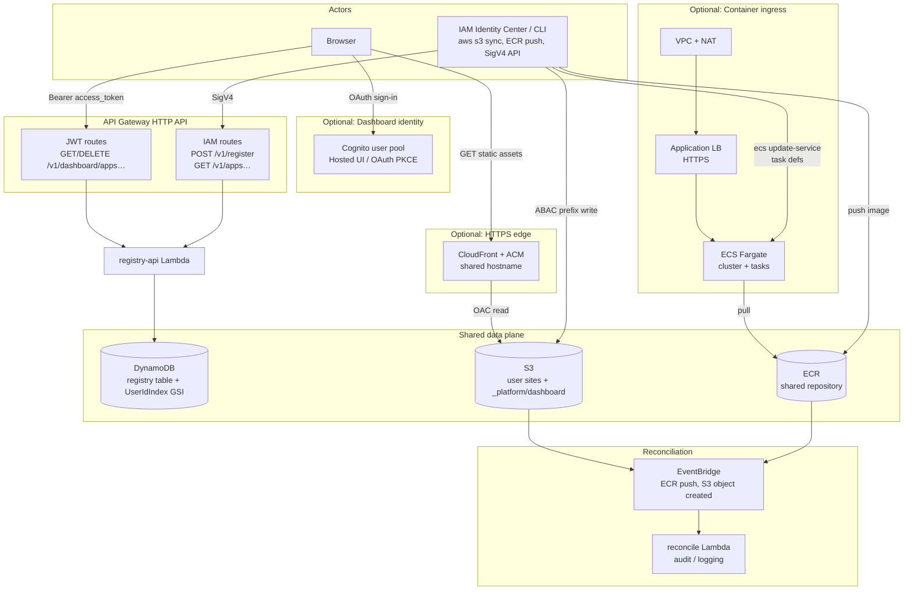

# CCToAWS architecture

This document describes the shared publishing platform: **registry API**, **static sites** (S3), **containers** (ECR), optional **CloudFront**, optional **VPC + ALB + ECS Fargate** for container ingress, optional **web dashboard** (Cognito + JWT), and **EventBridge** reconciliation.

## Diagram



### Flow summary

| Path | Purpose |
|------|---------|
| **CLI → IAM routes** | Register deployment metadata (`POST /v1/register`); list apps by IAM principal (`GET /v1/apps`). |
| **CLI → S3 / ECR** | Publish assets and images (ABAC-scoped prefixes/tags). |
| **Browser → Cognito** | OAuth login for the dashboard (PKCE). |
| **Browser → JWT routes** | List/delete registry rows by **`user_id`** (must match `user_id` on register items). |
| **Browser → CloudFront → S3** | Serve static sites and the dashboard SPA from the same bucket (path-based). |
| **CLI → VPC / ALB / ECS** (optional) | Fargate tasks in private subnets; ALB terminates TLS; NAT for image pull. Use outputs for **`runtime_url`**. |
| **EventBridge** | ECR and S3 notifications to the reconcile Lambda (registry remains source of truth). |

## Regenerate the PNG

With Graphviz installed and Python dependencies:

```bash
pip install -r scripts/requirements-diagrams.txt
python3 scripts/generate_architecture_diagram.py --out docs/cct_to_aws_architecture
```

This overwrites `docs/cct_to_aws_architecture.png` (and related outputs from the `diagrams` library).
